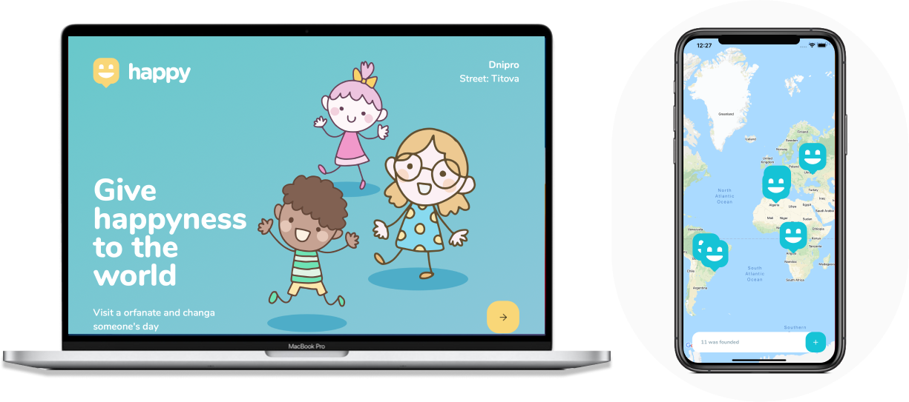

<h1 align="center">
    
</h1>

  <a href="#-Technologies">Technologies</a>&nbsp;&nbsp;&nbsp;|&nbsp;&nbsp;&nbsp;
  <a href="#-Project">Project</a>&nbsp;&nbsp;&nbsp;|&nbsp;&nbsp;&nbsp;
  <a href="#-Use">Use</a>&nbsp;&nbsp;&nbsp;|&nbsp;&nbsp;&nbsp;   
  <a href="#memo-Licence">Licence</a>

 
  

 

  

## 🚀 Technologies

This project was developed with the following technologies:
- [WebSite](https://horacio-sa-orphanage.netlify.app)
- [Node.js](https://nodejs.org/en/)
- [React](https://reactjs.org)
- [React Native](https://facebook.github.io/react-native/)
- [Expo](https://expo.io/)
- [TypeScript](https://www.typescriptlang.org/)

## 💻 Project

Happy is an application that connects people to institutional care homes to make many children's day happier;

## 🧠 Use:
- Yarn init
- CD to server/mobile/web
- Yarn start to run the mobile/web apps
- Yarn dev to run the server
## :memo: Licence

This project is under the MIT license. You can check the licence file [LICENSE](LICENSE.md) for more details.

---

Made ♥ by Horacio Sapato
